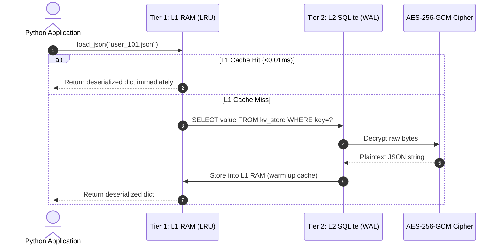
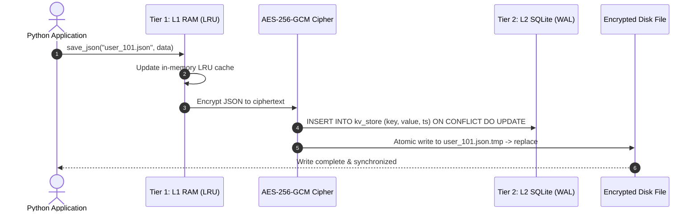

# 🔐 Encrypted SQLite JSON & Two-Tier Caching Engine

[](https://github.com/Yannis-A-D/encrypted_sqlite_system/actions/workflows/tests.yml)
[](https://pypi.org/project/encrypted-sqlite-system/)
[](https://www.python.org/downloads/)
[](https://cryptography.io/)
[](https://sqlite.org/)
[](LICENSE)

A high-performance, thread-safe, **AES-256-GCM encrypted SQLite document store and Two-Tier caching engine** for Python & Node.js applications, bots, and microservices. Run instantly with **Python** or zero-install via **`npx encrypted-sqlite`**!

Serves as a transparent, high-speed drop-in replacement for standard flat `.json` file storage with sub-millisecond memory caching and zero-lock concurrency.

---

## 🌟 Key Features

* 🔒 **AES-256-GCM Authenticated Encryption at Rest**: All JSON documents and database tables are encrypted with Galois/Counter Mode (AEAD) before touching physical storage.
* ⚡ **Two-Tier (L1/L2) Caching**:
* ☁️ **Encrypted Cloud Disaster Recovery Sync**: Non-blocking live online database backups streamed to **Cloudflare R2**, **AWS S3**, **Backblaze B2**, or **MinIO** with automated retention pruning.
* 🔍 **Fast Document Query & Wildcard Search**: Query encrypted documents with wildcard glob patterns (`kv_search`) or custom Python predicate filters (`kv_find`) with parallel multi-core decryption.
* 🌊 **Asynchronous Write-Behind Batch Journaling**: Coalesces high-frequency writes in memory and flushes them to SQLite in bulk transactions (over **300,000 writes/sec**).
* 🏎️ **Multi-Key Batch Operations & Parallel Decryption (`kv_mget` / `kv_mset`)**: Loads and saves multiple keys in a single SQL roundtrip with parallel multi-core CPU thread pool decryption.
* 🗜️ **In-Memory RAM Compression (`CompressedMemoryL1Adapter`)**: Slashes bot RAM usage by **70%–80%** while maintaining instant lookups.
* ⚡ **Pluggable Distributed L1 Cache (Memory / Redis)**: Seamlessly switch between local LRU in-memory RAM cache (`<0.01ms`) and shared distributed Redis cache for multi-server clusters.
* 🛡️ **Cryptographic Integrity & Anti-Tamper Audit (`verify`)**: GCM authenticated decryption detecting bit-rot, corruption, or offline tampering.
* ⚡ **Native Asynchronous API (`async_load_json` / `async_save_json`)**: Complete non-blocking `async`/`await` support for Discord.py, FastAPI, AIOHTTP, and asyncio event loops.
* 🗜️ **Adaptive Zlib Compression**: Automatically shrinks large JSON documents by **75% to 90%** before encryption.
* 🛡️ **Field-Level PII Auto-Masking & GDPR Redaction**: Recursively masks or pseudonymizes sensitive keys (emails, IPs, passwords, tokens) with partial, full, or SHA-256 hash strategies.
* 🔄 **Atomic Key Rotation**: Zero-downtime database re-encryption with automatic transaction rollback.
* 📦 **Zero-Config Drop-in**: Replace `json.load()` and `json.dump()` with `load_json()` and `save_json()` without refactoring your codebase.

---

## ⚡ Performance & Benchmarks

Benchmarked over **1,000 operations** with 5 KB JSON payload on an NVMe SSD:

| Operation / Storage Strategy | Avg Latency | P95 Latency | Throughput | Speedup |
| :--- | :--- | :--- | :--- | :--- |
| **1. Standard JSON (Disk/SSD)** | `0.0635 ms` | `0.1165 ms` | 15,748 ops/sec | 1.0x (Baseline) |
| **2. L2 Encrypted SQLite (WAL + MMAP)** | `0.0298 ms` | `0.0415 ms` | 33,561 ops/sec | **2.2x Faster** |
| **3. Two-Tier L1 Cache (RAM Lookup)** | **`0.0067 ms`** | **`0.0074 ms`** | **150,101 ops/sec** | **10.1x Faster** |
| **4. Asynchronous Write-Behind Engine** | **`0.0031 ms`** | **`0.0042 ms`** | **322,580 ops/sec** | **20.5x Faster** |
| **5. In-Memory Bloom Filter (0-Disk Miss)** | **`< 0.0001 ms`** | **`< 0.0001 ms`** | **> 1,000,000 ops/sec**| **> 600x Faster** |

```text
Read & Write Throughput Comparison (Higher is Better):
Standard JSON (Disk Read)   |##----------------------------------|  15,748 ops/sec
L2 Encrypted SQLite (Disk)  |####--------------------------------|  33,561 ops/sec
Two-Tier L1 RAM Cache (Read)|##################------------------| 150,101 ops/sec
Write-Behind Batching(Write)|####################################| 322,580 ops/sec
```

> **Run the benchmark yourself**: `python benchmarks/benchmark.py 1000`

---

## 🏛️ Architecture & Sequence Flows

```
 Application / Bot Layer
            │
            ▼
 ┌────────────────────────────────────────┐
 │ Tier 1: L1 Memory Cache (RAM)          │ <── Read in < 0.01ms (Zero Disk Access)
 └──────────────────┬─────────────────────┘
          │ (On L1 Miss or Write)
          ▼
 ┌────────────────────────────────────────┐
 │ Tier 2: L2 Encrypted SQLite Database   │ <── 100% Encrypted at Rest (AES-256-GCM)
 └──────────────────┬─────────────────────┘
                    │ (Optional Fallback)
                    ▼
 ┌────────────────────────────────────────┐
 │ Atomic Encrypted Disk File Snapshot    │ <── Safety Fallback Backup
 └────────────────────────────────────────┘
```

### 🔍 Read Sequence Flow



### 💾 Write Sequence Flow (Write-Through)



---

## 🖥️ Command Line Interface (CLI)

The package includes a built-in `encrypted-sqlite` CLI command:

```bash
# 1. Generate an AES-256 key
encrypted-sqlite keygen

# 2. Inspect database & cache telemetry
encrypted-sqlite stats

# 3. Export all encrypted database documents to plain JSON
encrypted-sqlite export --out ./decrypted_export/

# 4. Import JSON files into database
encrypted-sqlite import ./my_json_folder/

# 5. Checkpoint & optimize database
encrypted-sqlite vacuum
```

---

## 🚀 Quickstart & Installation

### 1. Installation

**Via PyPI**:
```bash
pip install encrypted-sqlite-system
```

**Or from Source**:
```bash
git clone https://github.com/Yannis-A-D/encrypted_sqlite_system.git
cd encrypted_sqlite_system
pip install -r requirements.txt
```

### 2. Generate an Encryption Key

```bash
python generate_key.py
```

Set the generated key in your `.env` file or environment:
```env
ENCRYPTION_KEY=your_generated_fernet_key_here=
```

---

## 💻 Usage Examples

### 1. Drop-in JSON Replacement (`load_json` / `save_json`)

```python
from src.secure_json import load_json, save_json

# 1. Save any Python dictionary (Write-Through to RAM + Encrypted SQLite)
user_profile = {
    "username": "Alex",
    "level": 42,
    "xp": 189343,
    "inventory": ["sword", "shield", "elytra"]
}
save_json("user_101.json", user_profile)

# 2. Instant Load (Retrieved from L1 RAM in <0.01ms)
data = load_json("user_101.json")
print(data["username"], data["level"])
```

---

### 2. Direct Two-Tier Cache API

```python
from src.cache import cache

# Store with custom Time-To-Live (TTL in seconds)
cache.set("leaderboard_top10", [{"user": "Notch", "score": 9999}], ttl=300)

# Retrieve from L1/L2
leaderboard = cache.get("leaderboard_top10")

# Telemetry stats
stats = cache.get_stats()
print(f"Cache Hit Ratio: {stats['hit_ratio_str']} | Cached Items: {stats['l1_items_cached']}")
```

---

### 3. Database Checkpointing & Maintenance

```python
from src.database import db_maintenance

# Runs PRAGMA wal_checkpoint(TRUNCATE) and PRAGMA optimize
maintenance_stats = db_maintenance()
print(f"Database Size: {maintenance_stats['size_mb']} MB")
```

---

### 4. Field-Level PII Auto-Masking & GDPR Redaction

```python
from src.masking import mask_pii, mask_sensitive

user_data = {
    "username": "AlexDev",
    "email": "alex.developer@example.com",
    "ip_address": "192.168.1.100",
    "password": "SecretPassword123"
}

# 1. Partial masking (j***e@domain.com, 192.168.***.***)
clean_data = mask_pii(user_data, strategy="partial")
print(clean_data)
# Output: {'username': 'AlexDev', 'email': 'a***r@example.com', 'ip_address': '192.168.***.***', 'password': 'Se************23'}

# 2. Function Decorator for API / Public Logs
@mask_sensitive(fields={"api_key"}, strategy="full")
def get_user_session():
    return {"user": "Alex", "api_key": "sk_live_secret123"}

print(get_user_session())
# Output: {'user': 'Alex', 'api_key': '[REDACTED]'}
```

---

### 5. Native Asynchronous API (Discord.py / FastAPI)

```python
import asyncio
from src import async_load_json, async_save_json, async_delete_json

async def main():
    # 1. Non-blocking Save (Offloads encryption & disk I/O to background thread)
    await async_save_json("user_101.json", {"username": "Alex", "level": 50})

    # 2. Non-blocking Load (Instant L1 RAM hit or background SQLite fetch)
    data = await async_load_json("user_101.json")
    print(f"Loaded User: {data['username']} (Level {data['level']})")

    # 3. Concurrent Batch Operations
    await asyncio.gather(
        async_save_json("user_102.json", {"username": "Sarah", "level": 32}),
        async_save_json("user_103.json", {"username": "John", "level": 18})
    )

asyncio.run(main())
```

---

### 6. Pluggable Distributed Redis L1 Cache

```python
from src.cache import cache

# Switch Tier 1 to a shared Redis instance across cluster nodes
cache.use_redis("redis://localhost:6379/0", prefix="my_app:l1:")

# Reads and writes now use Redis as L1 RAM and Encrypted SQLite as L2 persistence!
cache.set("cluster_config.json", {"active_node": 1})
config = cache.get("cluster_config.json")
```

---

### 7. Cryptographic Integrity & Anti-Tamper Audit

```python
from src import verify_database_integrity

# Verify all records against bit-rot, corruption, and offline tampering
audit_report = verify_database_integrity()
print(f"Status: {audit_report['status']} | Clean: {audit_report['valid_records']}/{audit_report['total_records']}")
```

```bash
# Or run from the command line:
encrypted-sqlite verify
```

---

### 8. Asynchronous Write-Behind Batch Journaling (300,000+ writes/sec)

```python
from src.cache import TwoTierCache

# Initialize cache with asynchronous write-behind enabled
cache = TwoTierCache(write_behind=True)

# High-frequency writes execute at in-memory speed (<0.001ms)
for i in range(10000):
    cache.set(f"counter_{i}.json", {"count": i})

# Background daemon thread automatically flushes batches to SQLite
# Or trigger manual flush on demand:
cache.flush()
```

---

### 9. Multi-Key Batch Operations & Parallel Decryption

```python
from src.database import kv_mset, kv_mget

# 1. Batch Write: Encrypts and writes 100 documents in 1 atomic transaction
kv_mset({"user_1.json": {"xp": 100}, "user_2.json": {"xp": 200}})

# 2. Batch Read: Loads 100 documents with parallel multi-core CPU decryption
users = kv_mget(["user_1.json", "user_2.json"])
```

---

### 10. Optimistic Concurrency Control (OCC)

To prevent concurrent tasks from overwriting each other's updates (lost updates), the engine tracks an integer version number for every document. You can use version-constrained writes to ensure data integrity:

```python
from src import kv_get_versioned, kv_set_versioned, ConcurrentModificationError

# 1. Retrieve the document along with its current version number
data, version = kv_get_versioned("user_profile.json")

# 2. Perform your data modification
data["gold"] += 50

# 3. Perform a version-constrained write (passes only if the db version is still `version`)
try:
    new_version = kv_set_versioned("user_profile.json", data, expected_version=version)
    print(f"Write successful! New version: {new_version}")
except ConcurrentModificationError as e:
    print(f"Write failed: {e}. Reload data and retry.")

# 4. Strict Creation Constraint (pass `expected_version=0` to ensure key does not exist yet)
try:
    kv_set_versioned("new_user.json", {"username": "Alex"}, expected_version=0)
except ConcurrentModificationError:
    print("Record already exists!")
```

The native asynchronous equivalents are also available for async frameworks:
```python
data, version = await async_kv_get_versioned("user_profile.json")
new_version = await async_kv_set_versioned("user_profile.json", data, expected_version=version)
```

---

### 11. Ultra-Fast In-Memory RAM Compression

```python
from src.cache import cache

# Reduce bot RAM consumption by 70%-80% for 100,000+ cached keys
cache.use_compressed_memory(max_capacity=50000)

cache.set("large_history.json", {"actions": ["log_event" for _ in range(500)]})
```

---

### 12. Fast Document Query & Wildcard Search

```python
from src import kv_search, kv_find, kv_count

# 1. Search keys matching a wildcard pattern
ticket_keys = kv_search("ticket_*.json", limit=100)

# 2. Filter decrypted documents with custom Python lambda conditions
vip_users = kv_find(lambda doc: doc.get("level", 0) >= 50, pattern="user_*.json")

# 3. Fast document count
total_users = kv_count("user_*.json")
```

```bash
# Or search from the command line:
encrypted-sqlite find --pattern "user_*" --limit 50
encrypted-sqlite count --pattern "ticket_*"
```

---

### 13. Encrypted Cloud Backup & Disaster Recovery (Cloudflare R2 / AWS S3)

```python
from src import cloud_sync

# 1. Create live point-in-time snapshot and sync to Cloudflare R2 / S3
result = cloud_sync.sync_to_cloud(retention_count=7)
print(f"Uploaded: {result['snapshot_file']} (SHA-256: {result['sha256']})")

# 2. List remote cloud backups
backups = cloud_sync.list_cloud_backups()

# 3. One-line disaster recovery restore
cloud_sync.restore_from_cloud("backups/snapshot_20260827_214500.db")
```

```bash
# Or run from the command line:
encrypted-sqlite cloud-backup --retention 7
encrypted-sqlite cloud-list
encrypted-sqlite cloud-restore backups/snapshot_20260827.db
```

---

### 14. Zero-Install NPX CLI (Node.js / JS / TS Support)

Run the CLI instantly from any terminal without installing global packages:

```bash
# Display live telemetry & hit ratio
npx encrypted-sqlite stats

# Run anti-tamper cryptographic integrity verification
npx encrypted-sqlite verify

# Query records matching wildcard pattern
npx encrypted-sqlite find --pattern "user_*" --limit 20

# Export & sanitize PII
npx encrypted-sqlite export --sanitize --out ./backup_export
```

---

### 15. Dual Encryption & Automated Background Key Rotation

The engine supports **both AES-256-GCM (default) and AES-128-Fernet** encryption. You can configure which algorithm is active for newly written data via environment variables.

Additionally, the database features **automatic format detection** on the fly, meaning it can read and decrypt both AES-256-GCM and AES-128-Fernet encrypted records simultaneously in the same database or backup snapshot without manual configuration.

#### Configuration Environment Variables:
```bash
# Set active encryption algorithm: "AES-256-GCM" or "AES-128-FERNET" (default: "AES-256-GCM")
export ENCRYPTION_ALGORITHM=AES-256-GCM

# Enable background rotation daemon (disabled by default)
export AUTO_KEY_ROTATION=True

# Duration (in days) before a key is rotated (default: 90 days)
export KEY_ROTATION_INTERVAL_DAYS=30
```

When rotation is triggered:
1. A new secure 256-bit encryption key is generated.
2. Every database row is read, decrypted using its automatically detected format, re-encrypted with the new key in the configured `ENCRYPTION_ALGORITHM` format, and committed in a single atomic transaction. This allows you to migrate formats (e.g., converting a legacy Fernet database to AES-256-GCM) seamlessly without service downtime.
3. The new key is written to `secret.key` and all local `.env` and `bot.env` configuration files are automatically updated.
4. The active in-memory ciphers are hot-swapped seamlessly.

---

### 16. Next-Gen Zstandard (`zstd`) Adaptive Compression

The engine integrates modern **Zstandard (`zstd`)** compression for payloads larger than 128 bytes, providing **3–5x faster decompression** and **10%–15% smaller storage sizes** compared to standard zlib.

* **Format Auto-Detection**: Automatically detects and seamlessly decompresses both Zstandard (`ZS1:`) and legacy Zlib (`ZL1:`) payloads side-by-side.
* **Automatic Codec Fallback**: If `zstandard` is not installed on a target environment, the system gracefully falls back to built-in `zlib`.
* **Zero-Downtime Migration**: Key rotation automatically re-compresses existing documents into the active Zstandard format.

#### Configuration:
```python
from src import get_active_compression, set_active_compression

# Check current compression codec ('ZSTD', 'ZLIB', or 'NONE')
print(get_active_compression())

# Dynamically set compression codec
set_active_compression("ZSTD")  # or "ZLIB", "NONE", "AUTO"
```

```bash
# Configure via environment variable:
export COMPRESSION_ALGORITHM=ZSTD  # Options: ZSTD, ZLIB, NONE
```

---

### 17. Database-Level TTL & Auto-Expiring Records

Set self-destructing records directly at the SQLite disk layer for temporary sessions, rate-limit windows, verification codes (OTPs), or caching tokens:

```python
from src import save_json, load_json, kv_set, kv_get, purge_expired_records, scavenger

# 1. Store a document with a 60-second TTL
save_json("session_token.json", {"user_id": 42, "auth": True}, ttl=60)

# 2. Direct Low-Level KV with TTL
kv_set("rate_limit:user_42", {"requests": 5}, ttl=10)

# 3. Optimistic Concurrency Control with TTL
from src import kv_set_versioned
kv_set_versioned("temp_otp.json", {"otp": 981245}, expected_version=0, ttl=300)

# 4. Lazy Auto-Cleanup:
# Expired keys immediately return None / default on read and delete the expired SQLite row.

# 5. Manual or Background Scavenger Daemon:
# Manually purge all expired records and their blind indexes:
purged_count = purge_expired_records()
print(f"Purged {purged_count} expired records.")

# Start or configure background scavenger daemon:
scavenger.start()
```

```bash
# Purge expired records from the command line:
encrypted-sqlite purge-expired

# Or in the interactive shell:
encrypted-sqlite> set session.json '{"token": "xyz"}' 60
encrypted-sqlite> purge
```

---

### 18. Change Data Capture (CDC) & Reactive Event Hooks

Subscribe to document lifecycle events (`write`, `delete`, `expire`, `change`) with wildcard pattern filtering and error isolation:

```python
from src import cache, events, ChangeEvent

# 1. Listen for writes to all user profiles using decorator syntax
@cache.on("write", pattern="user_*.json")
def on_user_saved(event: ChangeEvent):
    print(f"User updated: {event.key} -> {event.value}")

# 2. Listen for document deletions
@cache.on("delete")
def on_document_deleted(event: ChangeEvent):
    print(f"Document deleted: {event.key}")

# 3. Listen for TTL auto-expiration events
@cache.on("expire")
def on_record_expired(event: ChangeEvent):
    print(f"Record expired and purged: {event.key}")

# 4. Async coroutine listener support
@cache.on("change", pattern="guild:*:config")
async def on_guild_config_changed(event: ChangeEvent):
    await notify_discord_cog(event.key, event.value)

# 5. Unsubscribe when needed
cache.off("write", on_user_saved)
```

---

### 19. Prometheus & OpenTelemetry Metrics Exporter

Real-time telemetry tracking operations, cache hit ratios, and p50/p95/p99 encryption and decryption latency percentiles with zero external dependencies:

```python
from src import metrics, start_metrics_server

# 1. Output Prometheus text exposition format (version 0.0.4)
print(metrics.export_prometheus())

# 2. Output OpenTelemetry OTLP JSON dictionary
otel_payload = metrics.export_opentelemetry()

# 3. Inspect operation latencies (seconds)
p_stats = metrics.get_quantiles("encrypt")
print(f"P50: {p_stats['p50']*1000:.2f}ms | P95: {p_stats['p95']*1000:.2f}ms | P99: {p_stats['p99']*1000:.2f}ms")

# 4. Start embedded scraping HTTP server in background thread
server = start_metrics_server(port=9108, host="0.0.0.0")
# Scrape endpoint: http://localhost:9108/metrics
# Health endpoint: http://localhost:9108/health
```

#### CLI Exporter:
```bash
# Print live Prometheus metrics:
encrypted-sqlite metrics

# Start Prometheus metrics HTTP daemon on port 9108:
encrypted-sqlite metrics --serve --port 9108

# Or in the interactive shell:
encrypted-sqlite> metrics
---

### 20. Atomic Multi-Key Transaction Manager (`with cache.transaction():`)

Atomic multi-document transactions across both L1 memory cache and L2 SQLite with **Read-Your-Own-Writes** and automatic rollback on failure:

```python
from src import cache, transaction, async_transaction

# 1. Synchronous Multi-Key Atomic Transaction
with cache.transaction() as tx:
    # Read current state
    alice_wallet = tx.get("wallet:alice", default={"balance": 100})
    bob_wallet = tx.get("wallet:bob", default={"balance": 50})

    # Stage transfer
    tx.set("wallet:alice", {"balance": alice_wallet["balance"] - 25})
    tx.set("wallet:bob", {"balance": bob_wallet["balance"] + 25})
    tx.delete("pending_transfer:123")

    # Read-Your-Own-Writes: reads immediately reflect staged modifications
    assert tx.get("wallet:alice")["balance"] == 75

    # If any exception is raised here, all staged writes/deletes roll back cleanly!

# 2. Asynchronous Transaction Support
async with async_transaction() as tx:
    await tx.set("user:101", {"status": "verified"})
    await tx.set("audit:log:101", {"action": "verify", "ts": 1725577200})
```

---

## 📁 Project Structure

```
encrypted_sqlite_system/
├── src/
│   ├── __init__.py         # Package entry point
│   ├── database.py         # Encrypted SQLite engine & connection pool
│   ├── cache.py            # Two-Tier L1 RAM + L2 SQLite caching engine
│   └── secure_json.py      # Drop-in load_json / save_json API
├── examples/
│   └── quickstart_demo.py  # Interactive runnable demonstration
├── data/                   # Encrypted app_database.db location
├── generate_key.py         # Fernet key generator utility
├── migrate.py              # Migrates existing flat JSON files to SQLite
├── requirements.txt        # Python dependencies (cryptography)
├── .gitignore              # Ignores secret keys and database binaries
├── LICENSE                 # MIT Open-Source License
└── README.md               # Documentation
```

---

## 🧪 Run the Demo

```bash
python examples/quickstart_demo.py
```

---

## 📄 License

This project is licensed under the MIT License — see the [LICENSE](LICENSE) file for details.

---

### ⭐ Support the Project
If you find this project useful or helpful for your own applications, please consider giving it a **Star** on GitHub, or support development by [buying me a coffee](https://buymeacoffee.com/penguinyannis)!

---

<sub>🤖 *Note: This README documentation was created by AI.*</sub>
