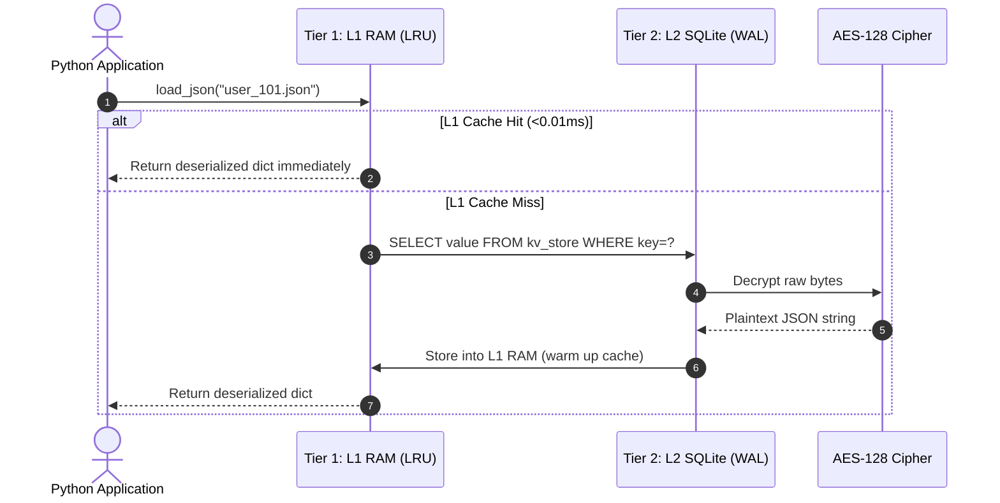
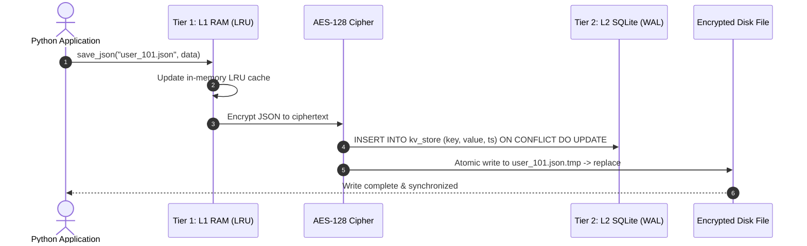

# 🔐 Encrypted SQLite JSON & Two-Tier Caching Engine

[](https://github.com/Yannis-A-D/encrypted_sqlite_system/actions/workflows/tests.yml)
[](https://pypi.org/project/encrypted-sqlite-system/)
[](https://www.python.org/downloads/)
[](https://cryptography.io/)
[](https://sqlite.org/)
[](LICENSE)

A high-performance, thread-safe, **AES-128 encrypted SQLite document store and Two-Tier caching engine** for Python applications, bots, and microservices.

Serves as a transparent, high-speed drop-in replacement for standard flat `.json` file storage with sub-millisecond memory caching and zero-lock concurrency.

---

## 🌟 Key Features

* 🔒 **AES-128 Fernet Encryption at Rest**: All JSON documents and database tables are encrypted before touching physical storage.
* ⚡ **Two-Tier (L1/L2) Caching**:
  * **Tier 1 (L1 RAM)**: Thread-safe Least-Recently-Used (LRU) in-memory cache delivering **`< 0.01ms` read latency** with zero disk I/O.
  * **Tier 2 (L2 Storage)**: High-concurrency **SQLite in WAL (Write-Ahead Logging) mode** with atomic transactions.
* 🗜️ **Adaptive Zlib Compression**: Automatically shrinks large JSON documents by **75% to 90%** before encryption.
* 🛡️ **Field-Level PII Auto-Masking & GDPR Redaction**: Recursively masks or pseudonymizes sensitive keys (emails, IPs, passwords, tokens) with partial, full, or SHA-256 hash strategies.
* 🔄 **Atomic Key Rotation**: Zero-downtime database re-encryption with automatic transaction rollback.
* 📦 **Zero-Config Drop-in**: Replace `json.load()` and `json.dump()` with `load_json()` and `save_json()` without refactoring your codebase.

---

## ⚡ Performance & Benchmarks

Benchmarked over **1,000 read operations** with 5 KB JSON payload on an NVMe SSD:

| Storage Strategy | Avg Latency | P95 Latency | Throughput | Speedup |
| :--- | :--- | :--- | :--- | :--- |
| **1. Standard JSON (Disk/SSD)** | `0.0607 ms` | `0.1139 ms` | 16,474 ops/sec | 1.0x (Baseline) |
| **2. L2 Encrypted SQLite (WAL)** | `0.0238 ms` | `0.0277 ms` | 42,049 ops/sec | **2.6x Faster** |
| **3. Two-Tier L1 Cache (RAM)** | **`0.0067 ms`** | **`0.0072 ms`** | **148,304 ops/sec** | 🚀 **9.0x Faster** |

```text
Throughput Comparison (Higher is Better):
Standard JSON (Disk)  |###--------------------------------|  16,474 ops/sec
L2 Encrypted SQLite   |#########--------------------------|  42,049 ops/sec
Two-Tier L1 RAM Cache |###################################| 148,304 ops/sec
```

> **Run the benchmark yourself**: `python benchmarks/benchmark.py 1000`

---

## 🏛️ Architecture & Sequence Flows

```
 Application / Bot Layer
            │
            ▼
 ┌────────────────────────────────────────┐
 │ Tier 1: L1 Memory Cache (RAM)          │ <── Read in < 0.01ms (Zero Disk Access)
 └──────────────────┬─────────────────────┘
          │ (On L1 Miss or Write)
          ▼
 ┌────────────────────────────────────────┐
 │ Tier 2: L2 Encrypted SQLite Database   │ <── 100% Encrypted at Rest (AES-128)
 └──────────────────┬─────────────────────┘
                    │ (Optional Fallback)
                    ▼
 ┌────────────────────────────────────────┐
 │ Atomic Encrypted Disk File Snapshot    │ <── Safety Fallback Backup
 └────────────────────────────────────────┘
```

### 🔍 Read Sequence Flow



### 💾 Write Sequence Flow (Write-Through)



---

## 🖥️ Command Line Interface (CLI)

The package includes a built-in `encrypted-sqlite` CLI command:

```bash
# 1. Generate an AES-256 key
encrypted-sqlite keygen

# 2. Inspect database & cache telemetry
encrypted-sqlite stats

# 3. Export all encrypted database documents to plain JSON
encrypted-sqlite export --out ./decrypted_export/

# 4. Import JSON files into database
encrypted-sqlite import ./my_json_folder/

# 5. Checkpoint & optimize database
encrypted-sqlite vacuum
```

---

## 🚀 Quickstart & Installation

### 1. Installation

**Via PyPI**:
```bash
pip install encrypted-sqlite-system
```

**Or from Source**:
```bash
git clone https://github.com/Yannis-A-D/encrypted_sqlite_system.git
cd encrypted_sqlite_system
pip install -r requirements.txt
```

### 2. Generate an Encryption Key

```bash
python generate_key.py
```

Set the generated key in your `.env` file or environment:
```env
ENCRYPTION_KEY=your_generated_fernet_key_here=
```

---

## 💻 Usage Examples

### 1. Drop-in JSON Replacement (`load_json` / `save_json`)

```python
from src.secure_json import load_json, save_json

# 1. Save any Python dictionary (Write-Through to RAM + Encrypted SQLite)
user_profile = {
    "username": "Alex",
    "level": 42,
    "xp": 189343,
    "inventory": ["sword", "shield", "elytra"]
}
save_json("user_101.json", user_profile)

# 2. Instant Load (Retrieved from L1 RAM in <0.01ms)
data = load_json("user_101.json")
print(data["username"], data["level"])
```

---

### 2. Direct Two-Tier Cache API

```python
from src.cache import cache

# Store with custom Time-To-Live (TTL in seconds)
cache.set("leaderboard_top10", [{"user": "Notch", "score": 9999}], ttl=300)

# Retrieve from L1/L2
leaderboard = cache.get("leaderboard_top10")

# Telemetry stats
stats = cache.get_stats()
print(f"Cache Hit Ratio: {stats['hit_ratio_str']} | Cached Items: {stats['l1_items_cached']}")
```

---

### 3. Database Checkpointing & Maintenance

```python
from src.database import db_maintenance

# Runs PRAGMA wal_checkpoint(TRUNCATE) and PRAGMA optimize
maintenance_stats = db_maintenance()
print(f"Database Size: {maintenance_stats['size_mb']} MB")
```

---

### 4. Field-Level PII Auto-Masking & GDPR Redaction

```python
from src.masking import mask_pii, mask_sensitive

user_data = {
    "username": "AlexDev",
    "email": "alex.developer@example.com",
    "ip_address": "192.168.1.100",
    "password": "SecretPassword123"
}

# 1. Partial masking (j***e@domain.com, 192.168.***.***)
clean_data = mask_pii(user_data, strategy="partial")
print(clean_data)
# Output: {'username': 'AlexDev', 'email': 'a***r@example.com', 'ip_address': '192.168.***.***', 'password': 'Se************23'}

# 2. Function Decorator for API / Public Logs
@mask_sensitive(fields={"api_key"}, strategy="full")
def get_user_session():
    return {"user": "Alex", "api_key": "sk_live_secret123"}

print(get_user_session())
# Output: {'user': 'Alex', 'api_key': '[REDACTED]'}
```

---

## 📁 Project Structure

```
encrypted_sqlite_system/
├── src/
│   ├── __init__.py         # Package entry point
│   ├── database.py         # Encrypted SQLite engine & connection pool
│   ├── cache.py            # Two-Tier L1 RAM + L2 SQLite caching engine
│   └── secure_json.py      # Drop-in load_json / save_json API
├── examples/
│   └── quickstart_demo.py  # Interactive runnable demonstration
├── data/                   # Encrypted app_database.db location
├── generate_key.py         # Fernet key generator utility
├── migrate.py              # Migrates existing flat JSON files to SQLite
├── requirements.txt        # Python dependencies (cryptography)
├── .gitignore              # Ignores secret keys and database binaries
├── LICENSE                 # MIT Open-Source License
└── README.md               # Documentation
```

---

## 🧪 Run the Demo

```bash
python examples/quickstart_demo.py
```

---

## 📄 License

This project is licensed under the MIT License — see the [LICENSE](LICENSE) file for details.

---

### ⭐ Support the Project
If you find this project useful or helpful for your own applications, please consider giving it a **Star** on GitHub — it helps others discover the project!

---

<sub>🤖 *Note: This README documentation was created by AI.*</sub>
