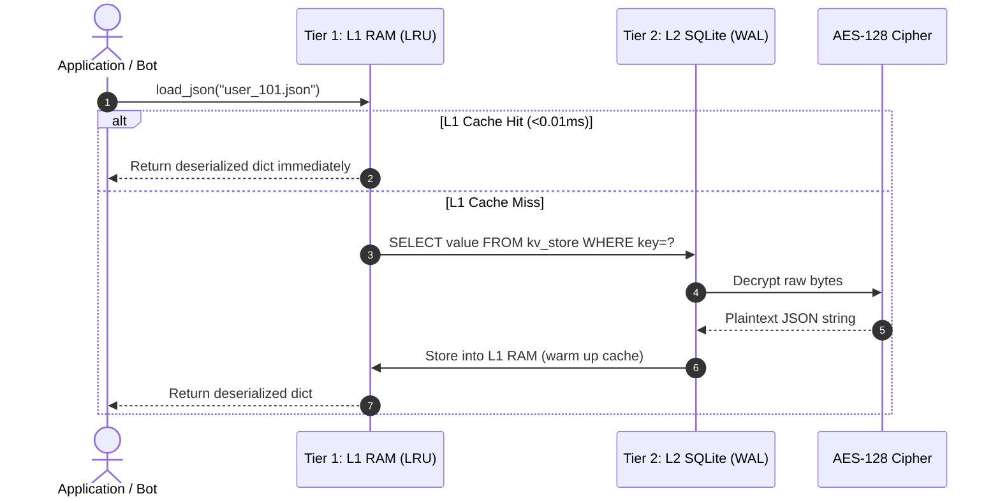
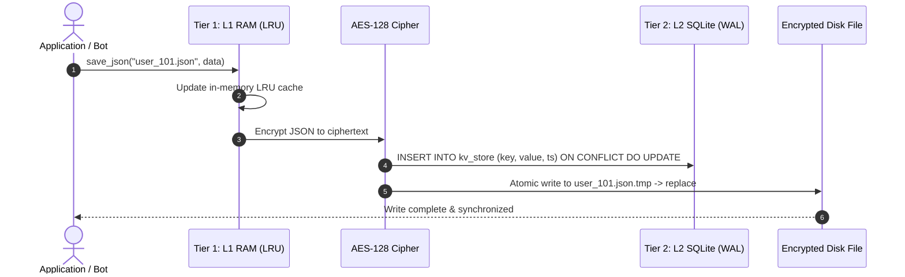

# 🏛️ Architecture & Caching Design

The system implements a formal **Two-Tier (L1/L2) Hierarchical Caching Engine** combined with **AES-128 Fernet Encryption at Rest**.

---

## 📊 Latency & Storage Hierarchy

| Tier | Layer | Media | Typical Latency | Description |
| :--- | :--- | :--- | :--- | :--- |
| **Tier 1 (L1)** | Application Cache | System RAM | **`< 0.01 ms`** | Thread-safe LRU in-memory cache |
| **Tier 2 (L2)** | Persistent Store | SSD / NVMe | **`~ 1.00 ms`** | AES-128 Encrypted SQLite Database |
| **Fallback** | Safety Snapshot | Local Disk | **`~ 2.50 ms`** | Atomic encrypted `.json` file backup |

---

## 🔄 Read Flow

---

## 💾 Write Flow (Write-Through)

